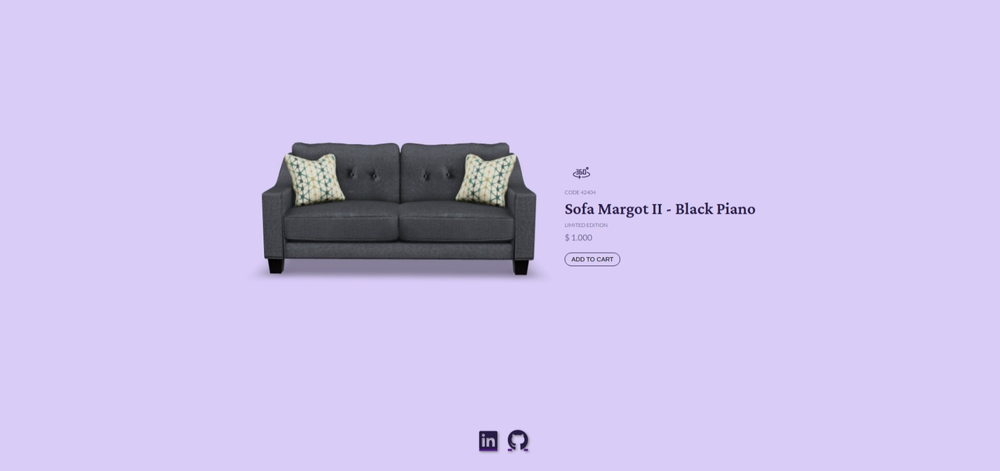
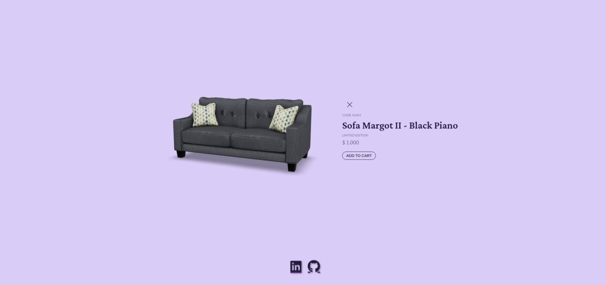

# Product Card 3D
## Desafio 2 Bora Codar - RocketSeat
[Preview Here]('https://guilhermehub12.github.io/Product-Card-3d/')
## Card de um Produto

### Techs Usadas
- HTML
- CSS
- Javascript
- [Model-Viewer]('https://modelviewer.dev/')
- [FontAwesome]('https://fontawesome.com/')
- [Sketchfab - 3d Models]('https://sketchfab.com/')

### O que aprendi
- Aprendi mais sobre usar figma como guia do css,
- Aprendi a melhor pesquisar sobre o que fazer com javascript,
- Fui atrás de implementar um modelo 3d e fazê-lo ser navegável 360°,
- Pensar nas soluções antes de escrever o código
- A sempre documentar o que fez no projeto;

### New Features
- Modelo de produto 3d
- Possibilidade de girar o produto com o mouse
- Ícones do fontawesome no footer